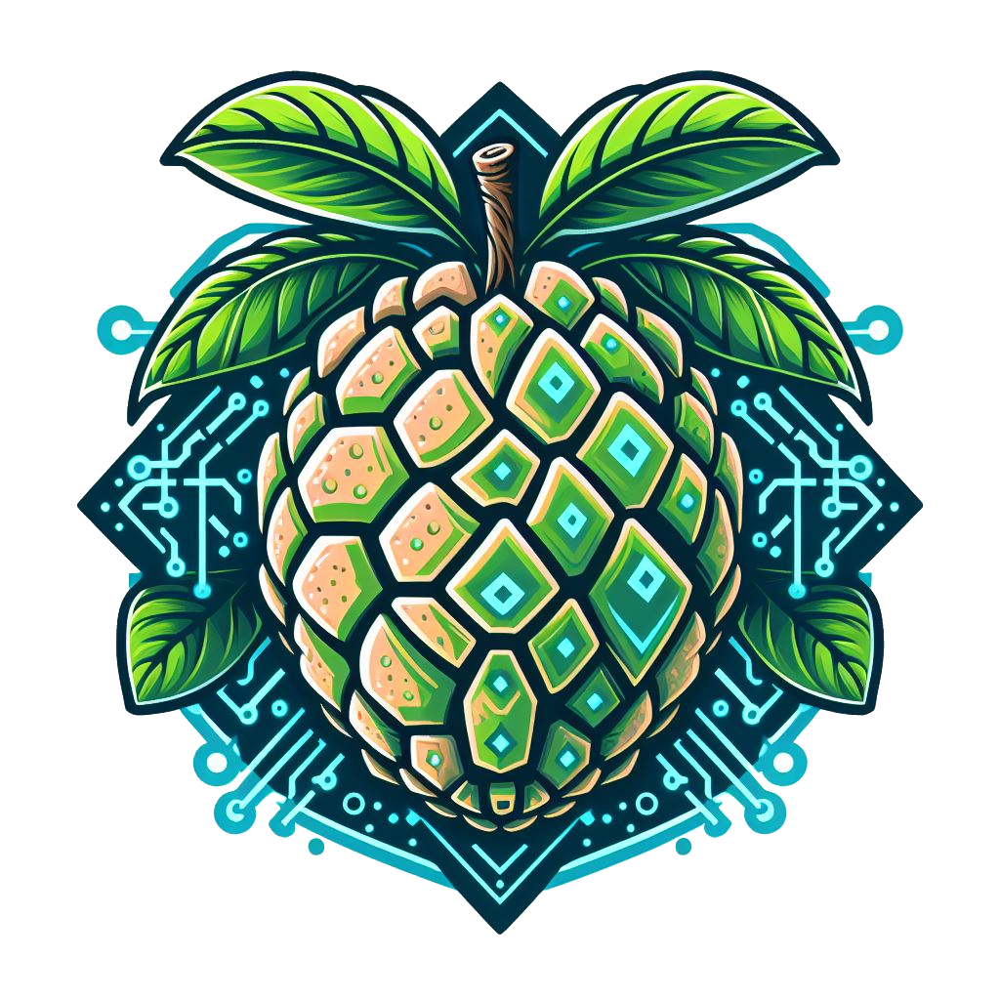

<!-- PROJECT SHIELDS -->
<a name="readme-top"></a>
[![Contributors][contributors-shield]][contributors-url]
[![Forks][forks-shield]][forks-url]
[![Stargazers][stars-shield]][stars-url]
[![Issues][issues-shield]][issues-url]
[![MIT License][license-shield]][license-url]
[![LinkedIn][linkedin-shield]][linkedin-url]
[](https://www.buymeacoffee.com/wanghley)


<!-- PROJECT LOGO -->
<br />
<div align="center">
  <a href="https://github.com/wanghley/cache-simulator">
    
  </a>

  <h3 align="center">AnnoNAS: AI-Powered Smart Home Server</h3>

  <p align="center">
    AnnoNAS is a cost-effective, space-efficient server designed for home use. It runs on a single computing board, providing affordability, power efficiency, and AI capabilities.
    <br />
    <a href="https://github.com/wanghley/cache-simulator"><strong>Explore the code »</strong></a>
    <br />
  </p>
</div>

<!-- TABLE OF CONTENTS -->
<details>
  <summary>Table of Contents</summary>
  <ol>
    <li><a href="#about-the-project">About The Project</a></li>
    <li><a href="#built-with">Built With</a></li>
    <li><a href="#getting-started">Getting Started</a></li>
    <li><a href="#usage">Usage</a></li>
    <li><a href="#roadmap">Roadmap</a></li>
    <li><a href="#contributing">Contributing</a></li>
    <li><a href="#license">License</a></li>
    <li><a href="#contact">Contact</a></li>
    <li><a href="#acknowledgments">Acknowledgments</a></li>
  </ol>
</details>

<!-- ABOUT THE PROJECT -->
## About The Project

The AnnoNAS project aims to create a smart home server that is both cost-effective and space-efficient. It runs on a single computing board, making it ideal for small spaces. Key features include:

- **Affordability**: AnnoNAS is designed to be budget-friendly, allowing users to set up a home server without breaking the bank.
- **Power Efficiency**: The server is optimized for low power consumption, reducing energy costs.
- **AI Capabilities**: AnnoNAS leverages AI technologies for tasks such as automation, security, and personalized services.

Whether you're a tech enthusiast or a casual user, AnnoNAS provides an accessible solution for home server needs.

<p align="right">(<a href="#readme-top">back to top</a>)</p>

### Built With

- C
- Valgrind
- GNU tools

<p align="right">(<a href="#readme-top">back to top</a>)</p>

<!-- GETTING STARTED -->
## Getting Started

To get started with AnnoNAS, follow these instructions:

### Prerequisites

- GCC

### Installation

1. Clone the repo:
   ```sh
   git clone https://github.com/wanghley/cache-simulator.git
    ```
2. Compile the code:
   ```sh
   gcc -g -o cachesim cachesim.c
   ```
3. Run the code:
   ```sh
   ./cachesim <trace file.txt> <cache size in kB> <Associativity> <Block size in B>
   ```

<p align="right">(<a href="#readme-top">back to top</a>)</p>

<!-- USAGE -->
## Usage

AnnoNAS serves as a smart home server, providing various functionalities such as automation, data storage, and AI-driven services. Use the instructions below to explore its capabilities:

### How to Run

1. Compile and run the AnnoNAS code.
2. Customize the server based on your home server requirements.
3. Explore AI-powered features and optimize memory access patterns.

Enjoy your smart home server experience with AnnoNAS!

<p align="right">(<a href="#readme-top">back to top</a>)</p>


<!-- MARKDOWN LINKS & IMAGES -->
[contributors-shield]: https://img.shields.io/github/contributors/wanghley/cache-simulator?style=for-the-badge
[contributors-url]: https://github.com/wanghley/cache-simulator/graphs/contributors
[forks-shield]: https://img.shields.io/github/forks/wanghley/cache-simulator.svg?style=for-the-badge
[forks-url]: https://github.com/wanghley/cache-simulator/network/members
[stars-shield]: https://img.shields.io/github/stars/wanghley/cache-simulator.svg?style=for-the-badge
[stars-url]: https://github.com/wanghley/cache-simulator/stargazers
[issues-shield]: https://img.shields.io/github/issues/wanghley/cache-simulator.svg?style=for-the-badge
[issues-url]: https://github.com/wanghley/cache-simulator/issues
[license-shield]: https://img.shields.io/github/license/wanghley/cache-simulator.svg?style=for-the-badge
[license-url]: https://github.com/wanghley/cache-simulator/blob/master/LICENSE.txt
[linkedin-shield]: https://img.shields.io/badge/-LinkedIn-black.svg?style=for-the-badge&logo=linkedin&colorB=555
[linkedin-url]: https://linkedin.com/in/wanghley


